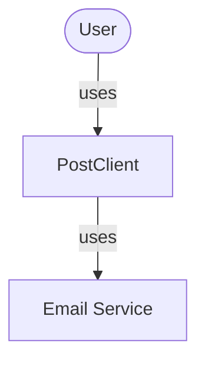
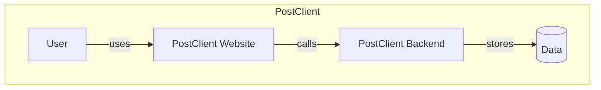
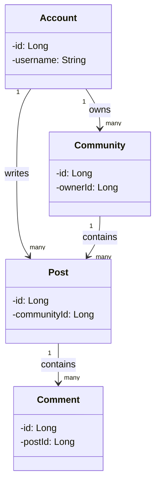
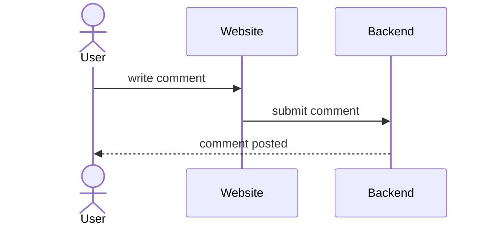

# PostClient

<!-- CI badge: after Session 4, replace ORG/REPO and the workflow filename, then uncomment:

-->

**Student:** Yousuf Habouh · **Course:** CEN 5064 Software Design, Fall 2026 · **Partner:** [@ghechavarria]

## Project (approval paragraph — write this by Sun Aug 30)

The system will implement a chatting application, which will be called PostClient. I'll make this project by implementing a backend that allows for account creation and community creation, and a frontend that showcases posts on the involved communities for a user. I am making this because one of the main reasons users use the internet is to communicate with each other, and this will offer one more avenue of communication.

Business Rules:
- A user can be the owner of 10 communities at most.
- A user can subscribe to 200 communities at most (subscription is an option that enables notifications on new posts)
- A community needs exactly 1 owner at all time.
- A user can either upvote once, downvote once, or not vote for any single post/comment.

Core Features:
- A person can make an account.
- An account can make a community which they would own by default.
- Accounts can create Posts under a community.
- Accounts can post comments under a post or other comments.

## How to run

```
[Exact commands to build and run your system from a clean clone.
Update this every time the steps change — your partner and your
instructor will follow it literally on conference days.]
```

## Architecture

### Tier breakdown (Session 2 studio)

| Tier | Responsibilities in THIS system |
|------|--------------------------------|
| Presentation | Displays Posts in a column list when checking a community with getPostList, displays comments in a column list under posts getCommentList. Will support light and dark mode with setLightMode |
| Service | create an account createAccount, create a community createCommunity, edit a comment editComment, etc |
| Domain | Accounts can only subscribe to 200 communities, can upvote once only per comment/post, a community can have 1 owner at most |
| Data | SQL tables store account information, account sign in data, a table for comments, a table for posts, a table for communities |

### C4 — Context & Container (Session 3 studio)

## 1. Context Diagram



## 2. Container Diagram



### UML — Class & Sequence (Session 3 studio)

## 3. Class Diagram



## 4. Sequence Diagram — Posting a Comment




## Architecture Decision Records

Decisions live in [`docs/adr/`](docs/adr/). Start with ADR-001 in Session 4.

| # | Decision | Status |
|---|----------|--------|
| [001](docs/adr/adr-001.md) | [What I am building and why] | [proposed] |

## Weekly log (optional but recommended)

A one-line note per week keeps your commit story readable:

- Week 1 (Aug 24): repo created, three ideas drafted
- Week 2 (Aug 31): ...
